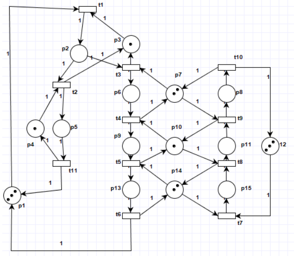
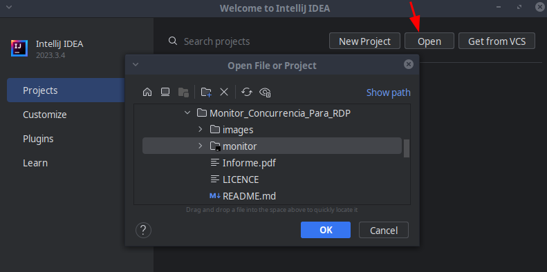
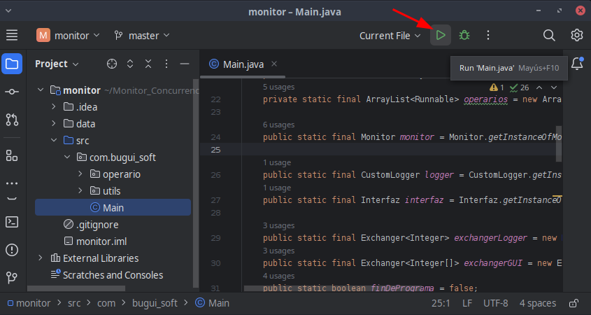

<!-- Improved compatibility of back to top link: See: https://github.com/othneildrew/Best-README-Template/pull/73 -->
<a name="readme-top"></a>
<!--
*** Thanks for checking out the Best-README-Template. If you have a suggestion
*** that would make this better, please fork the repo and create a pull request
*** or simply open an issue with the tag "enhancement".
*** Don't forget to give the project a star!
*** Thanks again! Now go create something AMAZING! :D
-->


<!-- PROJECT SHIELDS -->
<!--
*** I'm using markdown "reference style" links for readability.
*** Reference links are enclosed in brackets [ ] instead of parentheses ( ).
*** See the bottom of this document for the declaration of the reference variables
*** for contributors-url, forks-url, etc. This is an optional, concise syntax you may use.
*** https://www.markdownguide.org/basic-syntax/#reference-style-links
-->
[![Contributors][contributors-shield]][contributors-url]
[![Forks][forks-shield]][forks-url]
[![Stargazers][stars-shield]][stars-url]
[![Issues][issues-shield]][issues-url]
[![MIT License][license-shield]][license-url]
[![LinkedIn][linkedin-shield]][linkedin-url]


<!-- PROJECT LOGO -->
<br />
<div align="center">
  <a href="https://github.com/Fran-cio/concurrencyMonitorUsingPetriNets">
    
  </a>

<h3 align="center">Concurrency monitor using Petri nets.</h3>

  <p align="center">
    Petri net simulator implemented using a concurrency monitor.
    <br />
    <a href="https://github.com/Fran-cio/concurrencyMonitorUsingPetriNets"><strong>Explore the docs »</strong></a>
    <br />
    <br />
    <a href="https://github.com/Fran-cio/concurrencyMonitorUsingPetriNets">View Demo</a>
    ·
    <a href="https://github.com/Fran-cio/concurrencyMonitorUsingPetriNets/issues">Report Bug</a>
    ·
    <a href="https://github.com/Fran-cio/concurrencyMonitorUsingPetriNets/issues">Request Feature</a>
  </p>
</div>


<!-- TABLE OF CONTENTS -->
<details>
  <summary>Table of Contents</summary>
  <ol>
    <li>
      <a href="#about-the-project">About The Project</a>
      <ul>
        <li><a href="#built-with">Built With</a></li>
      </ul>
    </li>
    <li>
      <a href="#getting-started">Getting Started</a>
      <ul>
        <li><a href="#installation">Installation</a></li>
      </ul>
    </li>
    <li><a href="#usage">Usage</a></li>
    <li><a href="#contributing">Contributing</a></li>
    <li><a href="#license">License</a></li>
    <li><a href="#contact">Contact</a></li>
    <li><a href="#acknowledgments">Acknowledgments</a></li>
  </ol>
</details>


<!-- ABOUT THE PROJECT -->
## About The Project
<div align=center>
    
</div>
<br>
Petri nets are a powerful tool for modeling dynamic and concurrent systems. However, to develop software that implements this model, complex concurrency control systems are required. For this purpose, a concurrency monitor is implemented, which is a high-level abstraction designed by Charles Antony Richard Hoare in an article from 1974.

For a comprehensive analysis of the project, it is proposed to review [the academic report](Informe.pdf), which contains all the theoretical concepts and design decisions of the project.
<p align="right">(<a href="#readme-top">back to top</a>)</p>

### Built With

* 
* 
* 

<p align="right">(<a href="#readme-top">back to top</a>)</p>


<!-- GETTING STARTED -->
## Getting Started
The project was designed using the IntelliJ IDEA IDE from JetBrains, and the graphical interface was built with the GUI framework of the same. Therefore, importing and displaying the application may not be suitable if a different IDE is used.
### Prerequisites
Access the installation instructions for the following dependencies.
* [IntelliJ](https://www.jetbrains.com/idea/) 
* [Java 8](https://www.java.com/es/download/java8_update.jsp) 
* [Python 3](https://www.python.org/downloads/)
### Installation

1. Clone the repo
   ```sh
   git clone https://github.com/Fran-cio/concurrencyMonitorUsingPetriNets.git
   ```
2. Open the project 

    
3. Run Main

    

    Most likely, at this step, the appropriate JDK will be installed if you haven't installed it previously.

<p align="right">(<a href="#readme-top">back to top</a>)</p>


<!-- USAGE EXAMPLES -->
## Usage
Once executed, a GUI will be displayed that allows you to observe how the progress of the states of the network is distributed in each invariant. If the selection policy is correct and the network is viable, each invariant should be executed the same number of times.

<div align=center>
    
</div>

When the simulation ends, you will have on the screen the distribution of invariants and the final marking, after the execution of 1000 transitions.

Additionally, the file `data/Log.txt` will be generated, which will maintain the sequence of executed transitions.

By executing the script:
```sh
python data/expresiones_regulares.py
```
It will generate an analysis of the transitions and allow you to verify that the consistency of the program has not been violated at any time.

<p align="right">(<a href="#readme-top">back to top</a>)</p>


<!-- CONTRIBUTING -->
## Contributing

Contributions are what make the open source community such an amazing place to learn, inspire, and create. Any contributions you make are **greatly appreciated**.

If you have a suggestion that would make this better, please fork the repo and create a pull request. You can also simply open an issue with the tag "enhancement".
Don't forget to give the project a star! Thanks again!

1. Fork the Project
2. Create your Feature Branch (`git checkout -b feature/AmazingFeature`)
3. Commit your Changes (`git commit -m 'Add some AmazingFeature'`)
4. Push to the Branch (`git push origin feature/AmazingFeature`)
5. Open a Pull Request

<p align="right">(<a href="#readme-top">back to top</a>)</p>


<!-- LICENSE -->
## License

Distributed under the Beerware License🍻. See `LICENSE.txt` for more information.

<p align="right">(<a href="#readme-top">back to top</a>)</p>


<!-- CONTACT -->
## Contact

Francisco Ciordia Cantarella - francisco.ciordia.cantarella@gmail.com

Project Link: [https://github.com/Fran-Cio/concurrencyMonitorUsingPetriNets](https://github.com/Fran-Cio/concurrencyMonitorUsingPetriNets)

<p align="right">(<a href="#readme-top">back to top</a>)</p>


<!-- ACKNOWLEDGMENTS -->
## Acknowledgments
* [Sigleton Desing Pattern](https://refactoring.guru/es/design-patterns/singleton)
* [Factory Desing Pattern](https://refactoring.guru/design-patterns/factory-method)
* [Strategy Desing Pattern](https://refactoring.guru/es/design-patterns/strategy)
* [Consistency analysis](https://www.debuggex.com/)
* [Pretty Badges](https://github.com/Ileriayo/markdown-badges)
* [Logo Generator](https://www.bing.com/images/create?FORM=BICMB1&ssp=1&darkschemeovr=0&setlang=es-CL&safesearch=moderate&toWww=1&redig=8195C3604CE2443CAD2B9B2FB3512087)
* [Template of this readme](https://github.com/othneildrew/Best-README-Template?tab=readme-ov-file)

<p align="right">(<a href="#readme-top">back to top</a>)</p>


<!-- MARKDOWN LINKS & IMAGES -->
<!-- https://www.markdownguide.org/basic-syntax/#reference-style-links -->
[contributors-shield]: https://img.shields.io/github/contributors/Fran-Cio/concurrencyMonitorUsingPetriNets.svg?style=for-the-badge
[contributors-url]: https://github.com/Fran-cio/concurrencyMonitorUsingPetriNets/graphs/contributors
[forks-shield]: https://img.shields.io/github/forks/Fran-cio/concurrencyMonitorUsingPetriNets.svg?style=for-the-badge
[forks-url]: https://github.com/Fran-Cio/concurrencyMonitorUsingPetriNets/network/members
[stars-shield]: https://img.shields.io/github/stars/Fran-Cio/concurrencyMonitorUsingPetriNets.svg?style=for-the-badge
[stars-url]: https://github.com/Fran-Cio/concurrencyMonitorUsingPetriNets/stargazers
[issues-shield]: https://img.shields.io/github/issues/Fran-Cio/concurrencyMonitorUsingPetriNets.svg?style=for-the-badge
[issues-url]: https://github.com/Fran-Cio/concurrencyMonitorUsingPetriNets/issues
[license-shield]: https://img.shields.io/badge/license-Beerware%F0%9F%8D%BB-green?style=for-the-badge
[license-url]: https://github.com/Fran-Cio/concurrencyMonitorUsingPetriNets/blob/master/LICENSE.txt
[linkedin-shield]: https://img.shields.io/badge/-LinkedIn-black.svg?style=for-the-badge&logo=linkedin&colorB=555
[linkedin-url]: https://www.linkedin.com/in/francisco-ciordia-cantarella-5323461b8/
[product-screenshot]: images/screenshot.png
[usage-example]: images/example.png


